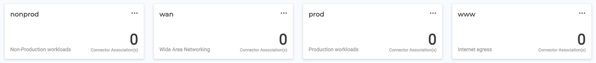

## Create Groups

The following example configuration will create three [alkira_group](https://registry.terraform.io/providers/alkiranet/alkira/latest/docs/resources/group) resources from configuration defined in **groups.yaml**. 

### Usage
To use this example, fill in the appropriate values in _variables.tf_ and provide those values _(including any secrets)_ by way of _terraform.tfvars_ or desired secrets management platform. Then run:

```bash
$ terraform init
$ terraform plan
$ terraform apply
```