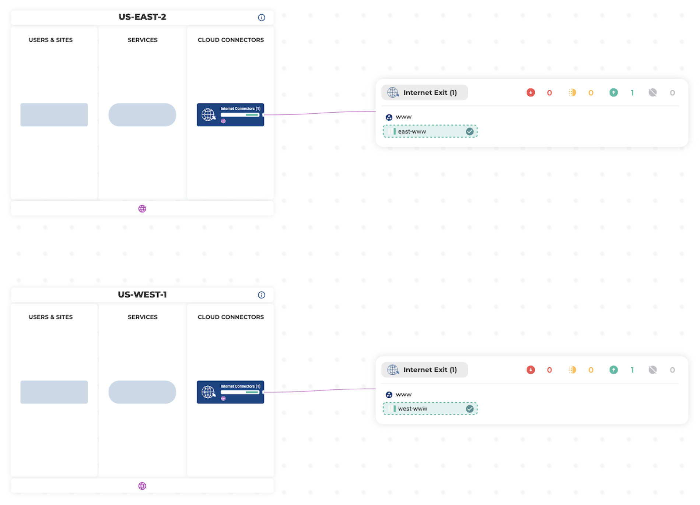

## Create Internet Exit Connectors

The following example configuration will create two [alkira_connector_internet_exit](https://registry.terraform.io/providers/alkiranet/alkira/latest/docs/resources/connector_internet_exit) resources from configuration defined in **connectors.yaml**. 

### First Internet Connector
The first example Internet Connector _'east-www'_ is created with defaults.

### Second Internet Connector
The second example Internet Connector _'west-www'_ is configured with advanced options.

### Usage
To use this example, fill in the appropriate values in _variables.tf_ and provide those values _(including any secrets)_ by way of _terraform.tfvars_ or desired secrets management platform. Then run:

```bash
$ terraform init
$ terraform plan
$ terraform apply
```